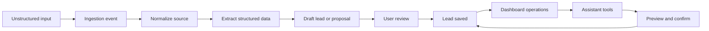

# Design: MVP Lead Ops Demo

## Architecture Decision

Use one full-stack Next.js repository for the MVP demo.

Do not split frontend and backend at the start. The MVP needs fast iteration, tight CopilotKit integration, shared TypeScript schemas, and simple deployment. A separate backend can be extracted later if ingestion volume, long-running processing, or provider integrations require it.

## High-Level Components

- Dashboard app: lead list, lead detail, follow-ups, metrics, activity history.
- API/domain layer: typed actions for leads, contacts, follow-ups, ingestion, and audit.
- Ingestion layer: stores source input and creates draft lead data or proposals.
- Extraction service: converts unstructured text/transcript into structured draft data. Demo Core uses a mock/deterministic implementation behind an interface.
- Calendar layer: later derives lead-related calendar items and availability from scheduled work.
- CopilotKit runtime endpoint: later bridges dashboard assistant to typed assistant tools.
- Database: PostgreSQL source of truth.
- Storage: later recordings and attachments when audio is introduced.

## Data Model

Primary entities:

- Workspace
- User
- Lead
- Contact
- FollowUp
- LeadEvent
- IngestionEvent

Later entities:

- Conversation
- Call
- Transcript
- Recording
- CustomFieldDefinition
- CustomFieldValue
- CalendarItem
- AssistantActionLog

Core rule:

Contact/client is the person or company. Lead is one specific request, job, project, deal, or service opportunity. CalendarItem is a scheduled or historical event related to a lead/contact.

Rules:

- Same person, same ongoing request: one Contact, one Lead, many CalendarItems or Activities.
- Same person, new request later: one Contact, new Lead.
- First contact creates or links a Contact, creates a Lead, and creates or derives a CalendarItem if there was a call, meeting, appointment, or scheduled slot.
- Repeated contact creates a CalendarItem or Activity; it creates a new Lead only if the request is distinct.

For Demo Core, calendar display is deferred. Store explicit calendar-like fields where useful: `scheduledAt`, `completedAt`, and `followUpDueAt`. Add a dedicated `calendar_items` table only if directly editable standalone events become required.

## Core Flow

## Demo Core Scope

Demo Core includes:

- pasted text/transcript input
- seeded workspace and fake user
- software services template
- mock/deterministic extraction
- draft lead creation
- lead list
- lead detail
- review/edit
- status changes
- follow-ups
- basic audit/activity
- simple metrics

Software services extractor target fields:

- contact name
- company or client organization
- source channel
- project type
- problem summary
- requested outcome
- budget range
- timeline
- next step
- scheduled time, if mentioned
- follow-up due time, if mentioned

Later MVP includes:

- custom fields
- calendar view
- assistant search
- assistant calendar awareness
- assistant mutations with preview
- live LLM extraction
- Telegram intake
- audio upload/transcription
- laptop repair and beauty templates

## Assistant Action Model

Later assistant tools:

- `find_leads`
- `open_lead`
- `update_lead_fields`
- `change_lead_status`
- `create_followup`
- `add_note`
- `create_custom_field`
- `update_custom_field_value`
- `summarize_lead`
- `list_followups`
- `list_calendar_items`
- `check_availability`

Tool rules:

- Tools are typed with Zod schemas.
- Tools call domain actions only.
- Mutating tools return a preview before persistence.
- Confirmed mutations write audit events.
- Ambiguous target leads require clarification.

## CopilotKit Design Notes

CopilotKit should be integrated after the base domain actions exist.

Expected implementation shape:

- Next.js route at `/api/copilotkit`
- CopilotKit provider around the dashboard shell
- Assistant side panel in the lead dashboard
- Human-in-the-loop approval for mutative assistant actions
- Generative UI/result cards for search results and previews

## Dashboard IA

Use a dense operational layout, not a marketing page.

Demo Core screens:

- Leads
- Lead detail
- Follow-ups
- Calls / ingestion inbox

Later screens:

- Calendar
- Settings / custom fields
- Assistant panel

MVP layout:

- left or main region: lead list/table
- detail region: selected lead
- assistant: side panel or drawer

## Repo Split Decision

Decision: single repository for MVP.

Reason:

- CopilotKit works most directly in a React/Next dashboard.
- Route handlers are enough for initial API and ingestion.
- Shared TypeScript schemas reduce drift between UI, API, and assistant tools.
- The user explicitly said a full backend is not needed at the start.

Split later only if:

- ingestion needs durable queues/workers
- telephony provider webhooks become complex
- Telegram bot needs independent runtime
- multiple clients share a stable public API

## Edge Cases

- Duplicate lead suspected
- Missing phone or contact name
- Empty or low-quality transcript
- User edits extracted values before save
- Invalid status transition
- Overdue follow-up
- Repeated interaction for same contact and same lead
- Repeated interaction for same contact but new lead
- Later: ambiguous assistant target
- Later: custom field type conflict
- Later: user rejects assistant preview
- Later: calendar item has missing duration
- Later: assistant availability request lacks timezone or working-hours context

## Open Technical Questions

- Supabase-only auth/storage vs separate auth and storage choices
- Which deployment target and database provider will be used for the public portfolio demo
