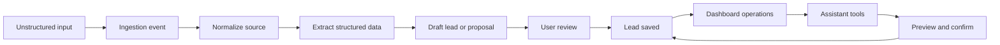

# Design: MVP Lead Ops Demo

## Architecture Decision

Use one full-stack Next.js repository for the MVP demo.

Do not split frontend and backend at the start. The MVP needs fast iteration, tight CopilotKit integration, shared TypeScript schemas, and simple deployment. A separate backend can be extracted later if ingestion volume, long-running processing, or provider integrations require it.

## High-Level Components

- Dashboard app: lead list, lead detail, follow-ups, custom fields, assistant panel.
- API/domain layer: typed actions for leads, custom fields, follow-ups, ingestion, and audit.
- CopilotKit runtime endpoint: bridges dashboard assistant to typed assistant tools.
- Ingestion layer: stores source input and creates draft lead data or proposals.
- AI extraction service: converts unstructured text/transcript into structured draft data.
- Database: PostgreSQL source of truth.
- Storage: recordings and attachments when audio is introduced.

## Data Model

Primary entities:

- Workspace
- User
- Lead
- Contact
- Conversation
- Call
- Transcript
- Recording
- CustomFieldDefinition
- CustomFieldValue
- FollowUp
- LeadEvent
- IngestionEvent
- AssistantActionLog

Core rule:

Lead is the main operational object. Calls, transcripts, recordings, follow-ups, custom fields, and assistant actions attach to or affect leads.

## Core Flow

## Assistant Action Model

Initial tools:

- `find_leads`
- `open_lead`
- `update_lead_fields`
- `change_lead_status`
- `create_followup`
- `add_note`
- `create_custom_field`
- `update_custom_field_value`
- `summarize_lead`
- `list_followups`

Tool rules:

- Tools are typed with Zod schemas.
- Tools call domain actions only.
- Mutating tools return a preview before persistence.
- Confirmed mutations write audit events.
- Ambiguous target leads require clarification.

## CopilotKit Design Notes

CopilotKit should be integrated after the base domain actions exist.

Expected implementation shape:

- Next.js route at `/api/copilotkit`
- CopilotKit provider around the dashboard shell
- Assistant side panel in the lead dashboard
- Human-in-the-loop approval for mutative assistant actions
- Generative UI/result cards for search results and previews

## Dashboard IA

Use a dense operational layout, not a marketing page.

Primary screens:

- Leads
- Lead detail
- Follow-ups
- Calls / ingestion inbox
- Settings / custom fields

MVP layout:

- left or main region: lead list/table
- detail region: selected lead
- assistant: side panel or drawer

## Repo Split Decision

Decision: single repository for MVP.

Reason:

- CopilotKit works most directly in a React/Next dashboard.
- Route handlers are enough for initial API and ingestion.
- Shared TypeScript schemas reduce drift between UI, API, and assistant tools.
- The user explicitly said a full backend is not needed at the start.

Split later only if:

- ingestion needs durable queues/workers
- telephony provider webhooks become complex
- Telegram bot needs independent runtime
- multiple clients share a stable public API

## Edge Cases

- Duplicate lead suspected
- Missing phone or contact name
- Empty or low-quality transcript
- Ambiguous assistant target
- Custom field type conflict
- User rejects assistant preview
- User edits extracted values before save

## Open Technical Questions

- Supabase-only auth/storage vs separate auth and storage choices
- Whether first demo uses seeded data, live LLM extraction, or both
- Whether to include audio upload in the first spec or keep it text/transcript-only
- Which deployment target and database provider will be used for the public portfolio demo
